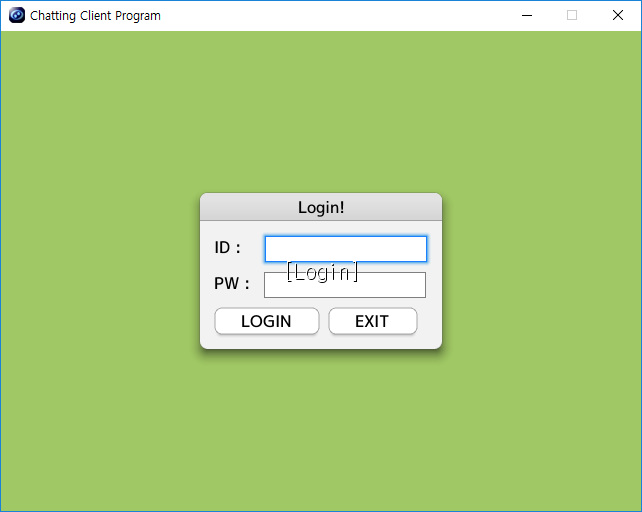
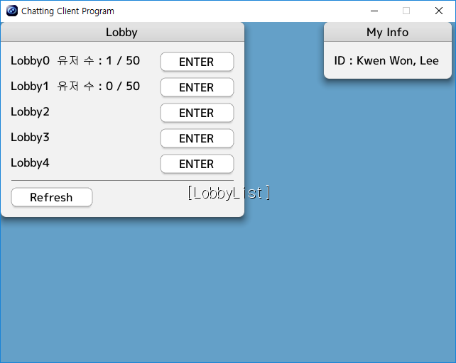
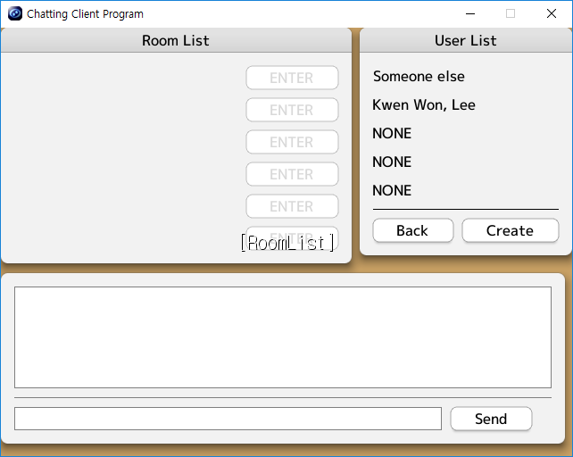
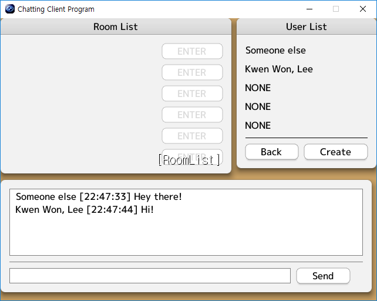
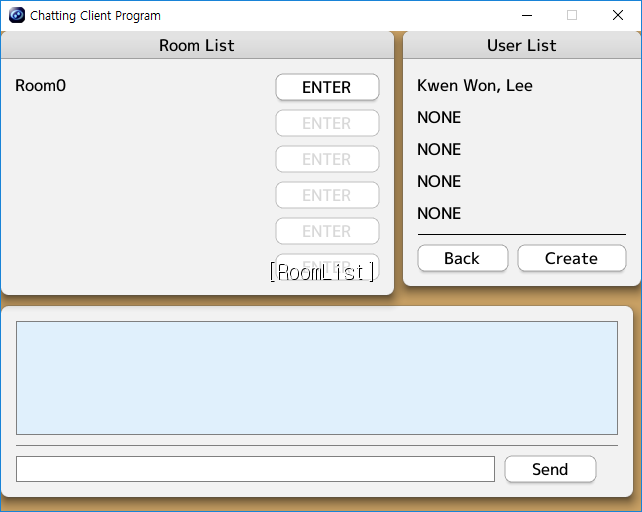
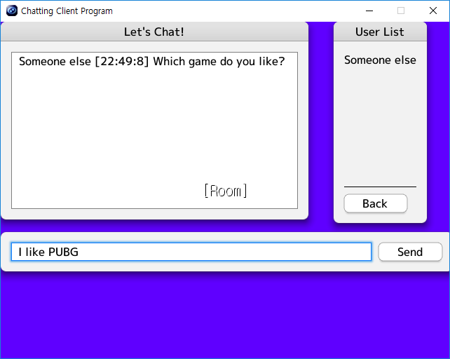

# ChattingClientProject
제공된 서버를 이용하는 채팅 클라이언트를 만들어보는 프로젝트입니다.  

사용 언어 : **C++**  
클라이언트 엔진 : **Siv3D**  

5학기 게임 서버는 이 채팅 클라이언트를 이용하여 만들게 됩니다.  
- - -

Login Scene 구현
================
  

적당한 아이디와 비밀번호를 입력한 뒤 LOGIN버튼 혹은 ENTER를 누르면 로그인을 시도합니다.  
EXIT를 누르면 프로그램을 종료합니다.  

- - -

Channel (LobbyList Scene) 구현
================

  

서버와 통신하여 로비 리스트를 받아옵니다.  
로비 옆 ENTER 버튼을 누르면 로비에 입장할 수 있게 됩니다.  

  

서버에 다른 유저가 존재하는 경우 유저 수를 알 수 있습니다.  

- - -
Lobby 구현
================

  

현재 로비에 존재하는 방 정보와 유저 정보를 알 수 있습니다.  
Back 버튼을 누르면 Channel Scene으로 돌아갑니다.  

  

Send 버튼과 채팅 윈도우를 통해 로비 내의 유저와 채팅을 할 수 있습니다.  

  

Create버튼을 누르면 로비 내부에 Room을 만들 수 있습니다.  
혹은 다른 사람이 Room을 만들었을 경우, Room List의 ENTER 버튼을 이용하면 만들어진 Room에 참가할 수 있습니다.  

- - -
Room 구현
================

  

Room 내부에서 또한 채팅을 할 수 있습니다.  
이후 5학기 게임 미들 웨어 수업과 게임 서버 수업에서 Room에서 대전 게임을 진행할 수 있도록 합니다.  

- - -
